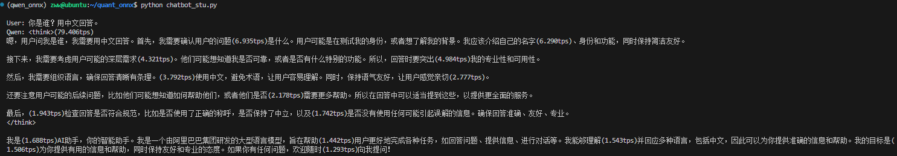
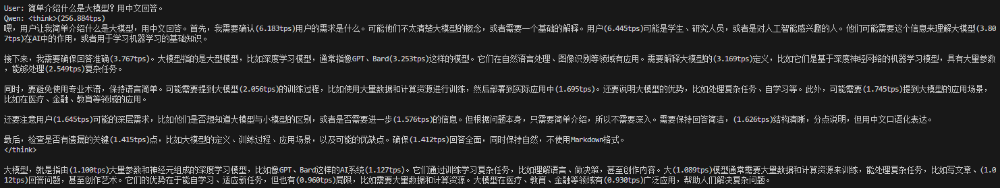
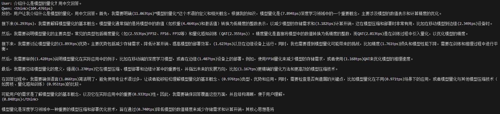

# Qwen3-1.7B 大模型端侧部署实战

## 1. 实验背景与目的
随着大语言模型（LLM）的发展，将模型部署在手机、PC 等端侧设备上（On-Device AI）成为热门趋势。本项目实现了把 LLM 从 PyTorch 训练框架迁移到 ONNX 通用推理框架的完整流程。

核心目标包括：  

1. **环境搭建**：配置无 GPU 环境下的大模型开发环境。

2. **模型导出 (Export)**：理解 PyTorch 动态图与 ONNX 静态图的区别，通过“算子补丁 (Monkey Patching)”和“模型包装 (Wrapper)”解决导出兼容性问题。

3. **模型量化 (Quantization)**：实现 INT8 静态量化，理解量化对模型体积和推理速度的影响。

4. **推理实战**：编写 Python 脚本，加载量化后的模型实现一个简单的对话机器人。


## 2. 实验准备

#### 2.1 硬件要求

- **CPU**: 建议 4 核以上 (Intel/AMD，指令集支持 AVX2/AVX512 体验更佳)

- **RAM**: 建议 16GB 以上 (FP32 模型导出过程瞬间内存占用较大)

- **Disk**: 至少 20GB 可用空间

#### 2.2 软件依赖安装
在终端中执行以下命令，创建 Conda 环境并安装 ONNX、 CPU 版本的 PyTorch 等相关工具。
```sh
# 1. 创建环境
conda create -n qwen_onnx python=3.10 -y
conda activate qwen_onnx

# 2. 安装 PyTorch (CPU版，减小下载体积)
pip install torch torchvision torchaudio --index-url https://download.pytorch.org/whl/cpu

# 3. 安装 HuggingFace 生态与 ONNX 工具链
# onnxscript 是 PyTorch 2.x 导出器的新依赖
pip install transformers accelerate onnx onnxruntime onnxscript

# 4. (可选) 设置 HuggingFace 国内镜像，加速模型下载
export HF_ENDPOINT=[https://hf-mirror.com](https://hf-mirror.com)
pip install -U huggingface_hub
```

#### 2.3 下载模型权重
使用命令行工具将 Qwen3-1.7B 模型下载到本地 Qwen3-1.7B 文件夹，避免实验中途网络中断。
```sh
huggingface-cli download --resume-download Qwen/Qwen3-1.7B --local-dir Qwen3-1.7B
```
或者运行下面的脚本执行下载：
```sh
python download_qwen3_1.7b.py
```

## 3. 实验步骤
```sh
# 1. 模型导出（Export）：Pytorch 迁移到 ONNX
python export_stu.py

# 2. 静态量化（Quantization）：FP32 量化为 INT8
pthon quant_stu.py

# 3. 推理对话（Inference）
python chatbot_stu.py
```

## 4. 实验观察
#### 4.1 文件体积对比：记录导出模型和量化后的具体文件大小，并计算压缩比。
```sh
# 终端执行
du -s *
# 显示：大小(KB), 文件/目录
3983944 Qwen3-1.7B
8       README.md
4       chatbot_stu.py
4       download_qwen3_1.7b.py
7937976 export
8       export_stu.py
1986736 quant
4       quant_stu.py
4       run.sh
4       setup_env.sh
```

答：量化前后文件大小：
- export/qwen3_fp32.onnx: $7,937,976 KB \approx 7.57 GB$
- quant/qwen3_int8.onnx: $1,986,736 KB \approx 1.89 GB$

压缩比：

$$
\frac{1,986,736 KB}{7,937,976 KB} \approx 0.2503
$$

#### 4.2 量化后的模型在 CPU 上生成文字的速度如何？
答：4.3 节的生成结果附上了每隔 20 tokens 打印的每秒生成字数。观察发现，随着生成字数的增加，tokens per seconds(tps) 逐渐减小，生成速度变慢。如从 6.935tps 到 1.293tps。

#### 4.3 量化后的模型是否依然能生成通顺的中文？请在报告中附上 2-3 轮对话的截图。




## 思考题：
在任务三中，目前的推理逻辑每生成一个字都要重新计算整个序列。如果想要加速，应该引入什么机制？（提示：KV Cache）

答：当前推理逻辑每生成一个新的 token 都需要将整个历史序列，包括初始 prompt 作为输入重新计算一次注意力机制，这导致了大量的重复计算，且计算复杂度随序列长度呈二次增长，使得推理速度随着生成的进行而逐渐下降（见 4.2 和 4.3 实验观察结果）。为了加速这一过程，应当引入 **KV Cache** 机制。该机制在首次计算 prompt 时，缓存每一层注意力模块中所有 token 的 keys 和 values，在后续的自回归生成过程中，对于每一个新生成的 token，只需要计算其对应的 query，然后将其与缓存中的所有历史 keys 进行注意力计算，同时将新 token 自身的 key 和 value 追加到缓存中。这样一来，避免了历史 token 的 key 和 value 的重复计算，将每次生成的计算复杂度从 $O(n^2)$ 降低到了 $O(n)$，从而显著提升长文本生成的推理效率。在实际部署中，需要在模型导出时将 KV Cache 作为可变的输入输出状态进行支持，并在推理循环中维护和更新这一缓存状态。

## 参考文档：
1. ONNX: https://onnx.ai/onnx/#
2. ONNX Runtime: https://onnxruntime.ai/